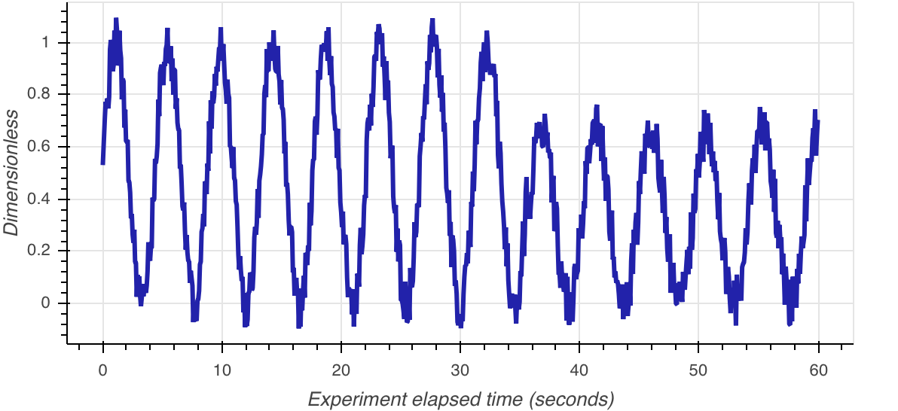
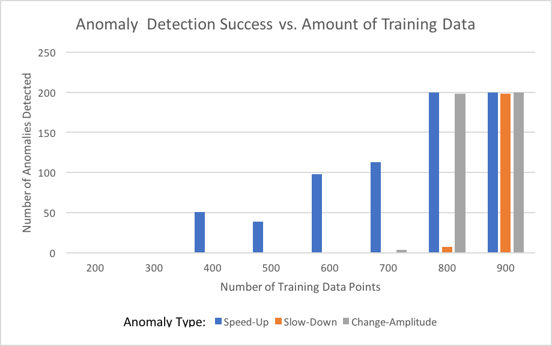
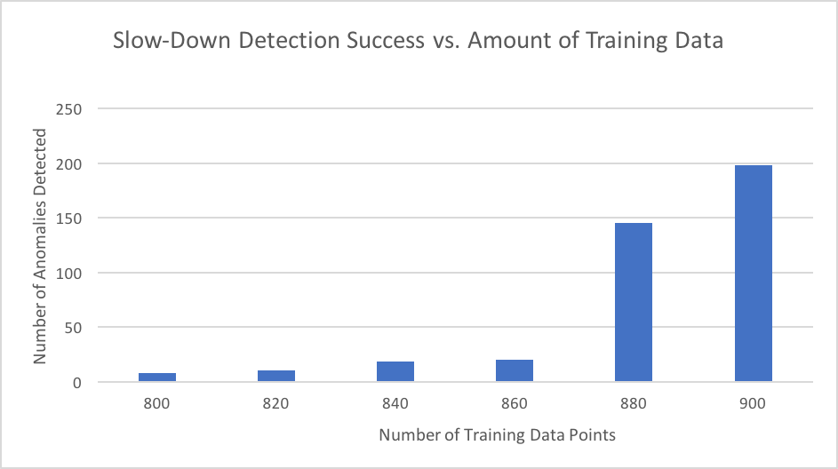
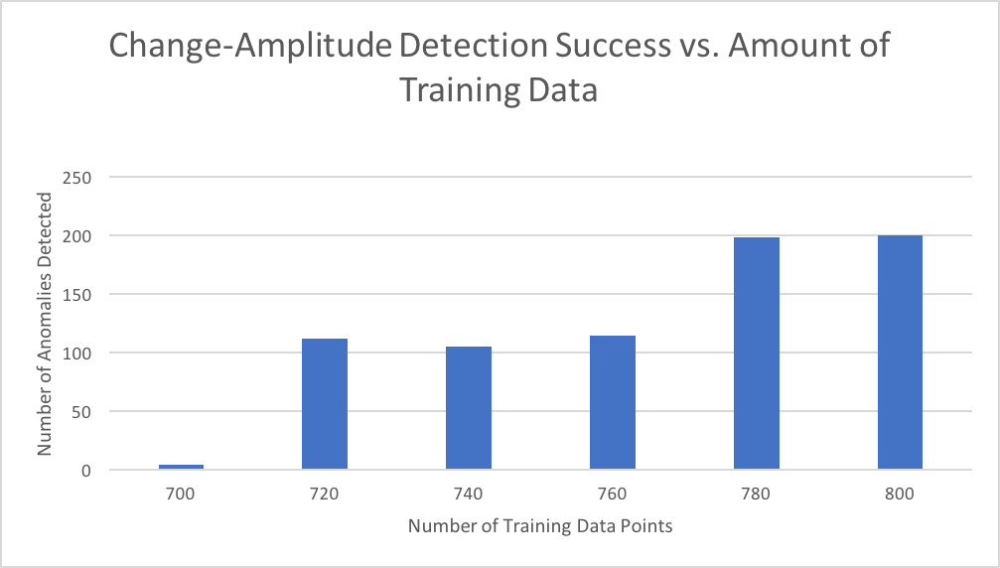
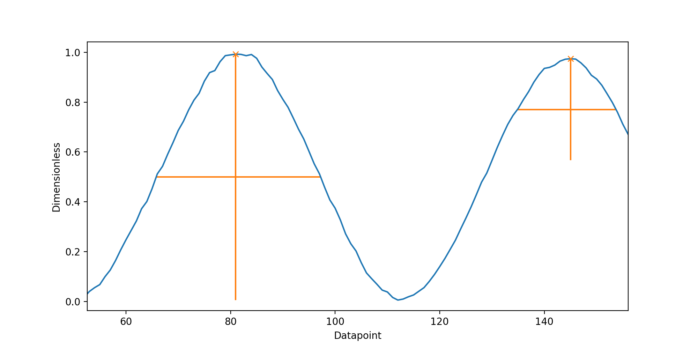
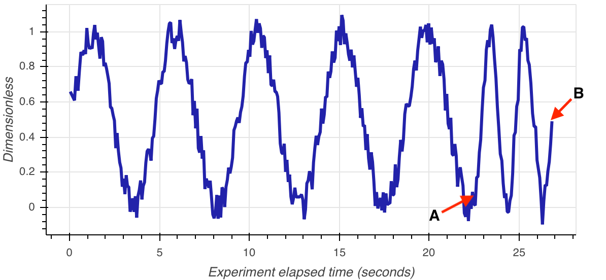

# Introduction

Laboratory-scale chemical synthesis has largely been done by hand since the time of alchemy.
Experimental reproducibility is harmed by this paradigm both because individual experimenters may not perform the same experiment precisely the same way each time and because imprecision in the communication of the experimental protocol between researchers may result in different results.
However, automating and scaling these types of experiments is a challenge in part because it is still not a trivial task to design, assemble, and reliably control a set of computerized laboratory equipment to execute specific task.

Continuous-flow experimentation is an alternative approach to chemical synthesis in which reactions occur continuously as the reagents are pumped together.
Thus, every step of the reaction is occurring at the same time.
Continuous-flow systems have been used for the synthesis of biomolecules [@Mijalis2017], pharmaceuticals [@Kitson2018], and fragarences [@Morin2019].
This type of experiment lends itself more readily to automation than step-by-step batch synthesis, but the ability to simultaneously control and monitor the pumps, sensors, heaters, and other components is still an open problem.

MechWolf is a Python package that aims to solve this proven by integrating chemical process design, analysis, and execution for both continuous-flow and batch experiments [@acs2018].
Often run on low-cost, highly constrained systems, such Raspberry Pis, MechWolf also enables chemists around the world to automatically collect data as their experiment executes and remotely monitor the experiment's progress.
A key aspect of the automated execution feature is that, in the event of an error, the system shuts down immediately.
However, due to hardware limitations, failures often do not raise errors and false positives are frequent.
Due to the reactive nature of the chemicals involved, undetected failures also pose a safety concern.

Therefore, it is important that MechWolf be able to monitor sensor data in real time to identify uncommanded changes to the system's state indictable of a failure.
Furthermore, this system must be able to work on devices without an internet connection and with extremely limited memory availability.
Because all flow-based robotic chemistry systems depend on one or more pumps to move liquids and the high failure rate of the pumps used in these systems, we identified autonomous pump monitoring as key feature to enable safer experimentation.

# Related work

There are several frameworks for robotic chemistry.
However, to the best of our knowledge there have not been any attempts to perform on-device learning in real time to detect anomalies.
Neither the Chemputer [@Kitson2018] nor Octopus [@octopus] have implemented anomaly detection of any kind.

There are several methods for time series anomaly detection, although only a subset of them are capable of being computed in real time on streamlining data.
One such method is the neuro-inspired hierarchical temporal memory (HTM) method, developed by Numenta to resemble the neocortex [@Ahmad2017].

# Methods

Because the pumps use in chemical systems generate sinusoidal waves when monitored by UV/visible light spectroscopy sensors, we focused on identifying anomalies with the waveforms present in the sensor data.
Since the devices have limited compute and memory capacity, we decided to use a recently published unsupervised tree-based method, the robust random cut forest (RRCF) for anomaly detection on the data streams [@rrcf].
RRCF enables us to precisely control the amount of memory used for anomaly detection to ensure that sufficient memory is available for MechWolf.
We eliminated threshold-based methods as too simple to capture the types of anomalies common to pumps in chemical systems. Similarly, we eliminated any models which were customized for a specific pump type due to the wide variety of pumps in use among MechWolf's users. Thus, we required a computationally efficient, fully unsupervised model capable of performing anomaly detection on streams of sinusoidal.

The source code for our methods is available online at [github.com/MechWolf/MechWolf/tree/CS249](https://github.com/MechWolf/MechWolf/tree/CS249).

## Robust Random Cut Forest

Soumil will write up a description of how RRCF works here.

To recall, our central  goal is to develop a method to detect anomalies in sensor reading data. We experiment on multiple types of anomalies including speed-up, slow-down, and change-amplitude anomalies, and aim to deploy a generic model which can catch all of these types. With this motivation, we employed the use of the Robust Random Cut Forest model, a machine learning model which we define below.

In essence, a Robust Random Cut Forest is a collection of independent Robust Random Cut Trees. RRCT is a recursively defined tree data structure where each node corresponds to a subset $S'$ of the total point set $S$. 

Definition 1.1 - Robust Random Cut Tree: a RRCT is defined on a set of points $S$, where points each have dimension $d$. Let $l_i = max_{x \in S}x_i - min_{x \in S}x_i, \forall i$ and let $p_i = \frac{l_i}{\sum_{j}l_j}$. We now select a random dimension $k \in \{1....d\}$ with probability proportional to $p_k$, and define the random variable $X_k$ ~ $Uniform[min_{x \in S}x_k, max_{x \in S}x_k]$. We now define our two children nodes corresponding to sets $S_1$ and $S_2$ such that  $S_1 = \{x|x \in S, x_k \leq X_k\}$, and $S_2 = S \backslash S_1$.  We then recurse on the two children corresponding to $S_1,S_2$ until either set corresponds to a singleton set, or the empty set (base case).

Definition 1.1 defines RRCT on a set of points $S$, however, in the case of streaming signal data points are continuously added to the set $S$, and hence must be dynamically added to the RRCT. Hence RRCTs allow for both insertion and deletion operations. That is, if we dynamically add a point $p$ to $S$, we have a function $insert(p)$ which takes as input $RRCT(S)$ and returns $RRCT(S \cup p)$ -  (detele is analogously defined). 

We omit the rigorous implementation of these functions but provide high level intuition for the insertion operation. When inserting a point p into the tree, we generate a new random cut along some random dimension, and then check if this cut separates point $p$ from set $S$. If it does, then we construct a parent node $k$ and specify that the two children of $k$ are the node corresponding to the point $p$ and the node corresponding $S$ (which is of course the root of the original tree). If the cut does not separate $S$ and $p$, we follow the existing cut and under the same process and recurse on either child of the current node until we have correctly isolated $p$ as a leaf node. Deletions are more simple; we simply remove the leaf node corresponding to $p$ from the tree, removing $p's$ parent, and then adding an edge between $p's$ sibling node to its grandparent node. 

We now need to formalize the definition of an anomaly in the context of RRCT/RRCF. We introduce the notion of the model complexity $M$ of a RRCT. If an RRCT $T$ is defined on a set $S$, let the depth of point $y \in S$  in the tree be given by the function $f(y, S, T)$. Now, the model complexity is given as follows $M(T) = \sum_{y \in S}f(y,S,T)$. Now, we wish to determine whether or not point $x$ is an anomaly, and we do so by measuring the change in model complexity induced by the removal of $x$, which is proportional to $\sum_{y \in S}f(y,S,T) - \sum_{y \in S - x}f(y,S - x,T')$. Remembering however that the generation of $T$ follows a random process and the mapping of $T(S)$ to $T(S - x)$ is many to one, we take the sum over the probability distribution of obtaining tree T with our randomized RRCT generation algorithm and define the quantity bit-displacement as $$BDisp(x, S) = \sum_{T, y \in S}Pr(T)(f(y,S,T) - f(y,S - x,T'))$$. 

$BDisp$ is one of many possible measures of anomalies. The measure our experiments used was Co-Disp which is similar to $BDisp$, but less instructive in this explanation and hence not detailed here. Intuitively, when we are evaluating whether or not point $x$ is an anomaly using $BDisp$, it is clear that we are more likely to achieve a higher $BDisp$ the shallower $x$ is as a leaf node in the tree. This is because the shallower $x$ is, the more nodes its sibling node $x'$ will tend to have in its subtree, and hence the more nodes will have their depth reduced upon the deletion of $x$ from the tree. This is a desireable property because our definition of RRCT means that anomaly points are likely to be isolated at shallower depths in the tree. To see why, consider the world in which cuts/partitions are made entirely randomly; clearly anomalous points should be isolated before other points in general. As it happens, under our definiton of RRCT, we are more likely to make cuts along dimensions which contain anomalous data and are even more likely than a completely uniformly random process to isolate anomalous points quickly, and hence in our RRCT anomalous points will tend to correspond to shallower leaf nodes. 

To generalize to a Random Robust Cut Forest is relatively straightforward. If an RRCF was comprised of $y$ RRCTs, then to evaluate the anomaly score for a point $x$, one can easily design an algorithm which instead of analytically summing over the entire probability distribution over RRCTs simply calculates the change in model complexity for each of the $y$ RRCTs when $x$ is removed from each of them, and then average them. The designer would then specify some threshold which if this average value exceeded would mean $x$ is classified as an anomaly. 

## Model Evaluation

To study the performance of the RRCF model, we extended MechWolf by creating a virtual sensor capable of returning simulated data indicative of various known failure modalities: uncommanded increases in pump frequency, uncommanded decreases in pump frequency, and incomplete pump actuation resulting in a decrease in amplitude.
This virtual sensor inserts noise into the output data stream in order to simulate noise in the spectroscopy reading.

In order to perform peak prominence and width finding on sensor data to use as features for the RRCF model, we relied on SciPy's signal processing routines [@scipy].
Similarly, to smooth the data, we used a moving average with a window size of 11 as implemented by SciPy [@scipy-cookbook].

We used the RRCF implementation in @Bartos2019 to calculate the collusive displacement of each datapoint in the stream.
To identify collusive displacement values that are indicative of an anomaly, we performed thresholding for values greater than 20 and more than two standard deviations from the mean collusive displacement.

## Real-Time Implementation

For the real time monitoring capability, we created a local Flask web server running as a separate process on the device ^[We note that this web server does not require an internet connection and that no data ever leaves the device.].
In MechWolf, reads from `Sensor` objects (the Python representation of the physical sensor) are routed to the `Experiment` object, which is responsible for plotting the data to the user interface and asynchronously writing the data to the disk. We therefore created a plugin which modifies the data reading procedure of all `Sensor` objects by first asynchronously reading serial data (or simulating it for the sake of our experiment) as usual and then asynchronously posting the new data to the anomaly detection server. The server then performs peak-finding and computes the anomaly score via RRCF.
If an anomaly is detected, the server shuts down and raises an error, which is propagated by the `Sensor` object to the MechWolf protocol executor, which in turn safely halts the experiment by returning all hardware to its predefined base state if configured to do so by the user ^[MechWolf can also send a push notification to alert the user or ask for confirmation of the anomaly before shutting down.].

During the course of our implementation of this feature, we discovered that performing peak-finding in real time yields incorrect results if the decreasing phase of the most recent peak is incomplete. Specifically, the calculated prominence and width is incorrect. Therefore, we had restricted 

# Results

## Model Evaluation

The goal of our model evaluation experiment was to ascertain how quickly we could train our RRCF model to reliably detect anomalies. We performed the same experiment for the three different types of anomalies. In our experiment, we modeled 200 sensors using MechWolf. Each sensor makes a discrete 'read' of the raw pump data with a frequency of 50Hz. We define the 'invokation threshold' which is simply an integer corresponding to the number of reads a sensor performs of the pump data before it starts producing anomalies. For example, if the invokation threshold at 200 and we wish to test the success of our model picking up anomaly type $x$, our experiment will deterministically produce anomaly $x$ at read $201$. We then evaluate whether or not our RRCF model, trained on the regular signal data obtained with $200$ reads, can pick up the anomaly at read $201$. Thus, we can vary the number of 'good training points' our model receives by varying the 'invokation threshold'. 

For each anomaly type we vary the invokation threshold from 200 to 900 and then measure how many anomalies the RRCF model detects. We enforce that each sensor only produces 1 anomaly in its lifetime (that is, the single anomaly induced immediately after the invokation threshold is crossed), thus because we have 200 sensors reading the pump data the maximum number of anomalies our RRCF model can detect is 200, constituting a perfect score. 

We specified two criteria which determined whether or not a given point was an anomaly. The first criteria used the aforementioned collusive displacement measure; if the introduction of a new point $x$ caused the average co-displacement of the set of 50 trees comprising the RRCF to increase beyond a specific threshold, $x$ was classified as an anomaly. The second criteria utilized standard deviation; [COME BACK TO THIS]. 

### RRCF can identify major anomalies with very little training data.

Because the sinusoidal waves in the signal from spectrographs are highly regular, minimal training data is required to identify anomalous pump actuation.

Our main findings are demonstrated on the graph below. For reference, the x-axis labeled as 'Number of Training Data Points' corresponds to the aforementioned invokation threshold, and hence simply refers to the number of 'good' training points the model received before the anomaly was induced. Our results demonstrate the unsurprising trend that anomaly detection improves as our model receives more training data. We see this trend differently for each anomaly type, however; for the 'speed-up' anomaly, we see a fairly regular upward trend of anomaly detection success as we increase the number of training points, whereas for both the 'change-amp' anomaly and 'slow-down' anomaly we have almost no success detecting anomalies whatsoever until we reach an invokation threshold of 800 after which our model catches every possible anomaly. We estimate that, given the parameters we specified for our pump that can be viewed in our source code, every 100 invokations/reads of the pump data yields approximately 1.6 wavelengths of signal data (prior to an anomaly, of course). Hence, we can quantify our results by stating that at both speed-up and change-amplitude anomalies were detected close to perfectly after our model was trained  approximately 12 'wavelengths' of true signal data, and slow-down anomalies were detected after it was trained on approximately 14 'wavelengths' of true signal data. 

In the above graph, we notice a gradual increase in the success rate of our model in detecting speed-up anomalies over the specified spread of invokation thresholds, but sudden jumps in success for both slow-down and change-amp anomalies. Thus, we constrain the invokation thresholds to investigate more closely how success rates increase for the latter two types of anomalies. Because the success of our model detecting 'slow-down' anomalies jumped to 200 from almost 0 between invokation thresholds 800 and 900, we examine the change between thresholds 800 and 900 below and see a relatively sudden jump in model success between thresholds 860 and 880. Similarly, we see a relatively sudden jump in model success detecting change-amp anomalies between thresholds 700 and 720. Statistically it is challenging to characterize why these sudden increases in model success occur, though we did notice that at the thresholds at which model success suddenly increased, the signal data often finished a full 'wavelength' at or near the threshold. 

Similarly, we see a relatively sudden jump in model success detecting change-amp anomalies between thresholds 700 and 720. Statistically it is challenging to characterize why these sudden increases in model success occur, though we did notice that at the thresholds at which model success suddenly increased, the signal data often finished a full 'wavelength' at or near the threshold. 

As part of our experiment, we also wanted to determine the extent to which our model would detect false-positives, that is, classify points as anomalies when they were in truth not anomalies. Empirically, we noticed that our model produced very few false positives for all invokation thresholds (under 5 for each experiment). 

### Featurization achieves better results faster.

We also benchmarked our results when using featurization (signal peaks and widths) against results obtained when our RRCF model was trained on raw signal data. When we passed raw signal data into the RRCF model, we saw a tremendous number of false positives generated and poor model performance detecting true anomalies even when invokation thresholds were set relatively high. It became quickly clear our approach would not work properly using raw signal data. 

## Real-Time Performance

We were successfully able to detect simulated anomalies in real time. Because we performed peak-finding on the full simulated dataset when evaluating the amount of training data required for online anomaly detection, we did not anticipate the challenge of online peak-finding. Specially, as shown in figure \ref{incomplete-detection}, performing peak prominence and width calculation on incomplete peaks (*i.e.* when the data reach a minimum) can result in an incorrect result, thereby generating an anomaly where there is none.

Therefore, we had to prevent the most recent detected peak from being inserted into the RRCF tree. This results in a delay of one wavelength between the first anomalous peak and its detection in real time, as shown in figure \ref{automatic-shutdown}. 

# Conclusion

Through our experiment, we were able to demonstrate the ability for an RRCF model to detect multiple types of anomalies with high success probabilities using minimal training data. After providing only approximately 12-14 full 'wavelengths' of true signal data to our RRCF model for training, it was able to generically detect each type of anomaly with close to 100% success probability. We also found that by featurizing the process, that is providing peak and width feature data instead of raw signal data to our RRCF model, we drastically improved the effectiveness of our model. 

# Next Steps and Discussion:

In this section we analyse the applicability of our findings to real signal anomaly detection tasks, its limitations, and the improvement points that could be explored as next steps. 

Firstly, our approach relied heavily on data featurization. Using a standard scipy method, we transformed raw signal data into data corresponding to signal peaks and widths/wavelengths, before using the transformed data for the anomaly detection task. Necessarily, this meant that anomalies could only possibly be detected when a new 'peak' was obtained and fed into our model. Consider a real-time setting in which the signal data has a very low frequency and peaks occur infrequently. Now consider an anomaly occuring at some point immediately after a given peak. Our model would only detect the anomaly upon the arrival of the next peak, hence producing a delay between the anomaly occuring and being detected. Such a discrepancy could prove costly in a lab depending on the experiment being conducted. Next steps could tackle this problem by either examining how a model could be tuned to properly process raw data, or by adding additional features to the featurized data set which don't depend on peaks (and hence signal frequency). 

Secondly, 

[REAL TIME STUFF CONCLUSION] 

<!-- leave this at the bottom because it writes the references at the end-->

# References
